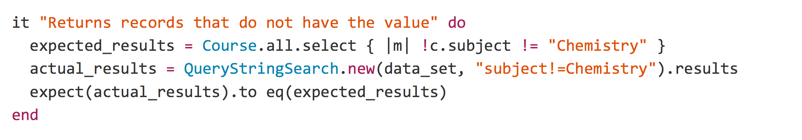
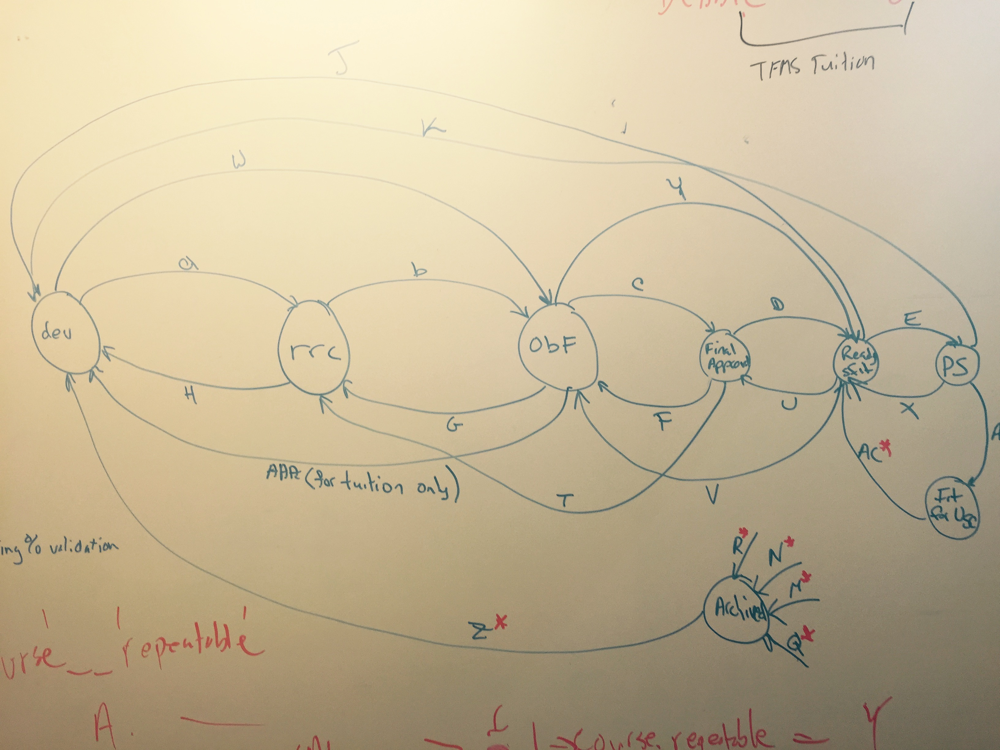
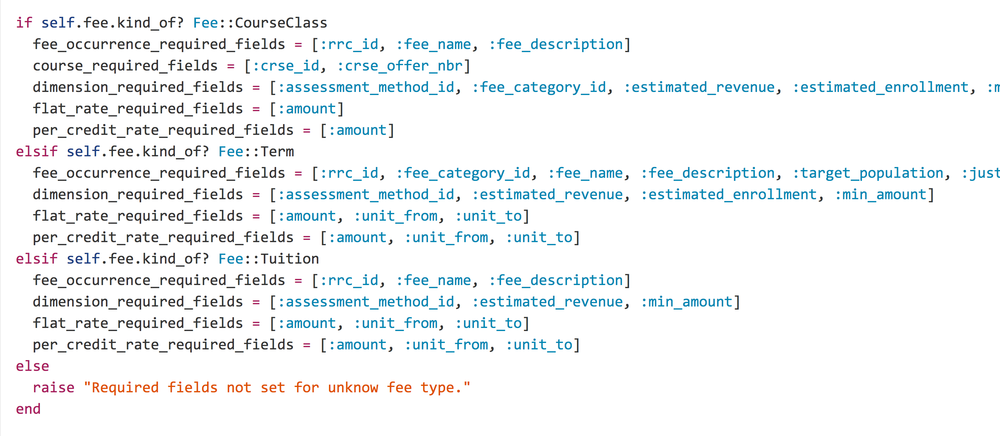
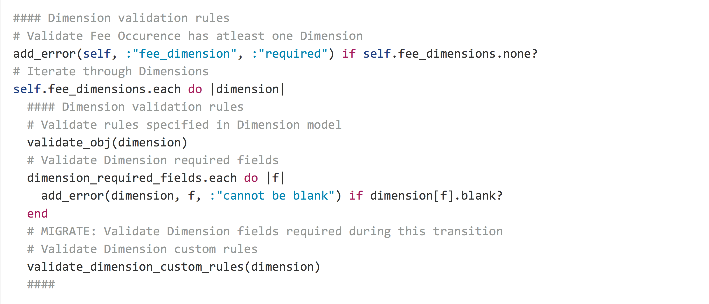

# Testing vs Tested

Note:
You, most likely, are not delivering new features as fast as you would like.
Or, worse, some of those features you deliver don't quite work the way the customer wants.
Or, worser, the small changes lead to unrelated bugs months afterwards.


# Your code is tested

Note:
- Maybe you try the feature out yourself after deploying
- Or you use some scripted tasks on a staging server, or your machine
- Or your users try it and tell you what's wrong


# But are you testing your code?

Note:
Testing code is an active act, it is intentional, repeatable and automatic
Tested code is everything else


# Tested
- Ad Hoc
- Usually testing a happy path, or some branches
- New bugs, features, etc do not always result in new tests


# Testing
- Done consistently
  - Either fully automated, or a standard practice
- Tests all branches
- Grows with your app
  - New features, bugs, etc all lead to new tests


# Storytime
## A Tested App

Note:
The customer for the app we're working on comes up and says "I need the app to allow this new feature!"
The team implements the feature, check it out on our Staging server and then deploy.
Days, weeks or months later they get a ServiceNow ticket.
The team dives back into the code for this app they haven't looked at for months.
After hours (days?) of work they puzzle out that this one new feature caused this apparently unrelated bug.
They fix the bug and deploy. Waiting for the next ServiceNow ticket to come in months from now.


# Storytime
## Testing an App

Note:
The customer for the app the Testing Team is working on comes up and says "I need the app to allow this new feature!"
The team adds a test to the test suite that proves the new feature works.
They implement the feature.
They run their tests.
An unrelated test fails.
After a short investigation, they discover the weird side effect and fix it.
All the tests pass, so they deploy and move on


# Speed and Humility

Note:
To me, the two differences to highlight between those stories are the developers' speed and humility


# Speed

Note:
Speed is probably the metric most people care about.
The testing developers had to spend some extra time writing tests. 
Maybe it was a few minutes, maybe a day.
So they delivered the feature after the Tested developers
But, the tested developers lost that head start when they had to spend days re-learning the code in order to fix it.
And they fall farther behind every time a new bug crops up


# Humility

Note:
People care about speed, but to me the important difference between those stories is the developers' humility.
The Tested Developers assumed their change would work.
Testing Developers assume they are wrong.
Testing Developers are right. We are wrong. All of the time.
Testing is a declaration. I will get this wrong.
I will forget how this code works in a month.
I will accidentally break this code.
I will be human.


# Less Touchy-Feely Junk
## Let's see some code

Note:
I define my job very simply. I need to do two things:

- Write new features
- Improve old code

Testing helps me do both: more quickly, consistently and accurately. Let's take a look.


# Add Features

Note:
At ASR we have a tool that we use to provide filtering/searching of data using URL query string parameters. 
For example, we can return all course records that have the subject "Chemistry". 
We have a new feature that we want to add: people want to find records that don't have an attribute. 
We start off with a test that shows how this feature will work.




Note:
This test does three things:

- Describes how the feature works
- Warns me if I break the feature in the future
- Tells me when I'm done

Each of these are incredibly valuable:

6 months later when another programmer (or myself) looks at this code, these tests succinctly explain what this code should do.
Much faster to understand than looking at the actual implementation.

Later, when I add a new feature or fix a bug, these tests will tell me if I introduced a new bug or broke some unrelated feature.

Finally, when I get this test to pass the first time then I know that I'm done. 
If I'm done, I can deploy and move on to the next feature. 

That's a lot of benefit from 5 lines of code.


# Improve code that already exists

Note:
At ASR we maintain a system that is used to track fees paid by students. Be it their tuition, a fee they pay for art supplies or the cost they pay for studying abroad. It's a hugely important application, obviously. And very complex.

Recently we had to make some changes to how Tuition fees are validated. This whole process is backed by finite state machine logic that looks like this:




Note:
The validation happens in code like this:



Note:
And this...



Note:
And so on. There's about 100 lines of this.

This code worked. But in 2 years we've never changed it. Now that we have to change it, who knows?
And if you look at the commit history from when this code was written, there's lots of commits like:


```ruby
Hotfix for INC0391422
Assessment method seed method now works correctly
Changes needed to make the app functional again 
```
Note:
This is not a good place to be in. The code is complex and hard to reason about.
And without tests we can't be sure what effect our changes have.
The commits tell us that there have been lots of weird side effects in the past.

Thankfully, Debbie and Davin wrote tests that cover all of this code. All those weird ifs/else/etc. 
Took them a couple of days. 
At the end, they could add the new validation rules the customer wanted and prove that it had no unexpected side effects. And it didn't. 
The customer was, I think, quite surprised at how easy this change turned out to be.

But, Debbie and Davin were able to go one step further. With their tests in place they could rewrite this code. Here's that first method now:


```ruby
validation_inspector.inspect!(self, errors)
```
Note:
And all the tests still pass.

A common knock against tests is that the time you spend writing tests could be spent writing new features. 
Debbie and Davin spent 2 days writing tests. In return we got:

- A new feature that introduced no bugs
- The ability to add features later without bugs
- The ability to refactor our ugly code into something better
    - Which leads to fewer bugs, faster features, and so on.

Time far from wasted.


# Testing Fears

- You write all your code twice
- Tests is slow
- Tests aren't perfect
- Testing is all-or-nothing

Note: These are common arguments I hear against automated testing of applications.
After 8ish years of writing automated tests, I've found kernels of truth and a lot of falsehood in these.


# You write all your code twice

Note:
There are definitely ways to write tests that are exact duplicates of the implementation code. For example, if we had a method that added numbers.


```ruby
def add_numbers(x, y)
  x + y
end

it "should add numbers" do
  x = 1
  y = 2
  expected = x + y
  assert_equal add_method(x, y), expected
end
```
Note:
In some cases this can be hard to avoid. But, in most cases, you are simply testing something in the wrong place.
This is a bigger topic that I can get into today, so we'll talk about it at a later Code People meeting.


# Tests are Slow

Note:
There are different types of tests, a topic that we plan to cover in later talks.
Some approaches are fast, some are slower.
Let's see how long it takes to run all the tests for our Courses api service, which is a mix of faster and slower tests.

[ run courses tests]

And here's a test suite that focuses on fast tests.

[ run query string tests]

On the flip side, we have apps with 30-minute test suites.
Fast tests get run all the time, slow tests don't. You can guess which tests are more useful.


# Tests aren't perfect

Note:
Of course they aren't. They are written by humans.
You will miss things. Bugs will appear.
Write a test that catches this bug, fix the bug and then move on, confident that this bug won't come back.


# Tests are all-or-nothing

Note:
You will never have time to write a full test suite for an untested application.
However, you will have time to write a couple tests.
And, later, you will have time to write a few more.
An application with some testing is better than an application with no tests.
It's the difference between throwing the dice, or throwing dice that are slightly weighted in your favor


# Testing is a skill

And like any skill it has to be learned, which means mistakes. 
Just as your first programs in a language will be terrible, so will your first tests.
It's ok.


# Begin Testing, Stop Being Tested

- Improve Your Existing Code<!-- .element: class="fragment" data-fragment-index="1" -->
- Add new features that work consistently<!-- .element: class="fragment" data-fragment-index="2" -->
- Actually look like you know what you're doing<!-- .element: class="fragment" data-fragment-index="3" -->
  - By admitting that you actually don't<!-- .element: class="fragment" data-fragment-index="4" -->
